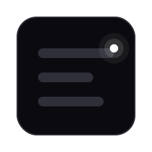

<div align="center">



<h1>Skeletonify</h1>

<h3>React skeletons that generate themselves.</h3>

<p><strong>Wrap a component. Get a skeleton. It gets smarter over time.</strong></p>

</div>

```jsx
<Skeletonify loading={isLoading}>
  <ProfileCard user={user} />
</Skeletonify>
```

<div align="center">

That's the whole API.

[](https://github.com/inaumanmajeed/Skeletonify/actions/workflows/ci.yml)
[](https://www.npmjs.com/package/@inaumanmajeed/skeletonify)
[](https://bundlephobia.com/package/@inaumanmajeed/skeletonify)
[](./LICENSE)

**[Live Demo](https://skeletonify.nauman.live)** · **[GitHub](https://github.com/inaumanmajeed/Skeletonify)** · **[Report a bug](https://github.com/inaumanmajeed/Skeletonify/issues)**

</div>

---

## The problem

You build `ProfileCard`. Then you build `ProfileCardSkeleton`. You change the component. The skeleton rots. Every React app has this two trees that say the same thing, forever drifting apart.

**Skeletonify kills the twin component.**

---

## Quick start

```bash
npm install @inaumanmajeed/skeletonify
```

```tsx
import { Skeletonify } from "@inaumanmajeed/skeletonify";

function Profile({ user, isLoading }) {
  return (
    <Skeletonify loading={isLoading}>
      <ProfileCard user={user} />
    </Skeletonify>
  );
}
```

Zero config. Works in Next.js, Vite, Remix. SSR-safe.

---

## How it works

Skeletonify has three layers. You get all three with zero setup. Each makes your skeletons better.

### L1 Instant (always on)

Reads your JSX and Tailwind classes to generate a skeleton at render time. Pure, synchronous, SSR-safe. No DOM measurement, no hidden renders, no flicker.

**Result:** a plausible skeleton on the very first load. Good enough for most apps.

### L2 Learns (automatic)

After your real UI paints, Skeletonify quietly observes the DOM on idle and caches the true layout. Next time the component loads, the skeleton is pixel-accurate.

**Result:** skeletons that get smarter every time a user visits. No code changes needed.

### L3 Perfect (one CLI command)

Pre-generate descriptors at build time. The skeleton is accurate from the very first paint no learning needed.

```bash
npx @inaumanmajeed/skeletonify-generate src/components/ --out .skeletonify --map
```

```tsx
import { registerBuildDescriptors } from "@inaumanmajeed/skeletonify";
import { skeletonMap } from "./.skeletonify/skeletonMap";

// Call once at app startup
registerBuildDescriptors(skeletonMap);
```

**Result:** pixel-perfect cold-start skeletons. L3 is fully optional if you never run the CLI, L1 and L2 handle everything.

---

## Priority

```
manual fallback  >  L3 build-time  >  L2 learned cache  >  L1 heuristic
```

Every layer is automatic. Higher layers override lower ones. Nothing breaks if a layer is missing.

---

## Features

- **Zero config.** Install, wrap, ship.
- **Zero flicker.** No hidden render, no DOM measurement, no swap.
- **SSR-safe.** Server and client produce identical output.
- **Tailwind-first.** Reads `w-*`, `h-*`, `rounded-full`, `flex`, `gap-*`, and more.
- **Self-improving.** L1 on first load, L2 on every load after.
- **5KB gzipped.** Zero runtime dependencies.
- **Accessible.** `aria-busy`, `role="status"`, respects `prefers-reduced-motion`.
- **Dark mode.** Respects `prefers-color-scheme`.
- **TypeScript-first.**

---

## API

```tsx
<Skeletonify
  loading={boolean}         // required  skeleton or real UI
  fallback?={ReactNode}     // optional  manual override
  id?={string}              // optional  stable cache key
  learn?={boolean}          // optional  disable L2 for this instance
  className?={string}       // optional  skeleton wrapper class
>
  {children}
</Skeletonify>
```

---

## FAQ

**Does it work with Next.js App Router?**
Yes. Skeletonify is a client component (`'use client'`). Inference is deterministic, so server and client render the same skeleton.

**Does it need Tailwind?**
No, but it works best with Tailwind. Without className hints, L1 falls back to element-type defaults. L2 learns the real layout regardless.

**What about charts / canvas / iframes?**
Opaque to inference. Use the `fallback` prop:

```tsx
<Skeletonify loading={isLoading} fallback={<MyChartSkeleton />}>
  <Chart />
</Skeletonify>
```

**What if I redesign a component?**
L1 adapts instantly (same JSX). L2 re-learns on the next visit. L3 re-generates when you re-run the CLI. Nothing goes stale automatically.

**Is L3 required?**
No. L1 + L2 cover most use cases. L3 is for teams that want deterministic cold-start accuracy.

---

## Contributing

```bash
git clone https://github.com/inaumanmajeed/Skeletonify.git
cd Skeletonify
npm install
npm test            # 62 tests
npm run build       # ESM + CJS
npm run demo:dev    # interactive playground
```

---

## License

MIT

<div align="center">

**If Skeletonify saved you an afternoon, star the repo.**

</div>
